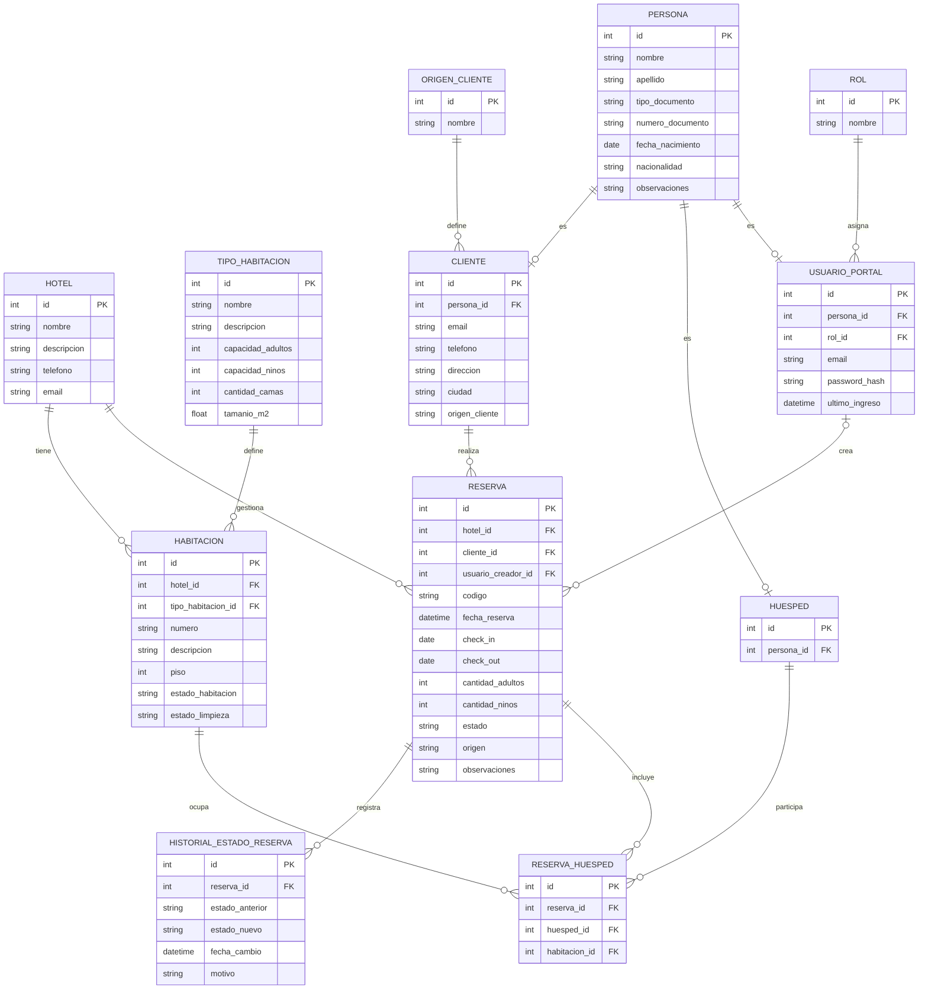

## Consideración

- Todas las tablas van a contar con las siguientes columnas base:
  - datetime created_at
  - datetime updated_at
  - boolean delete
  - datetime deleted_at

- Todos los registros deben ser marcados como eliminados con soft delete.
